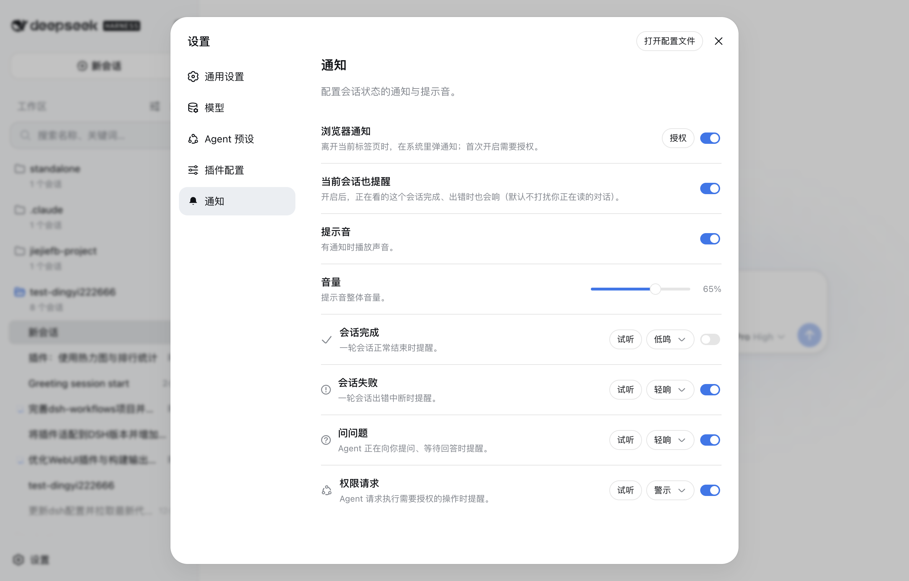
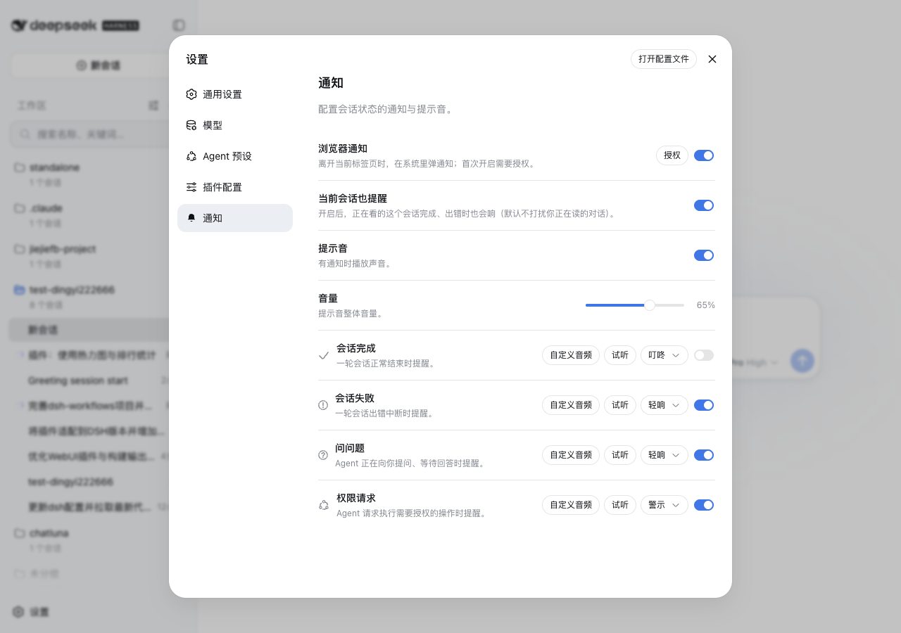

# @deepseek-ai/dsh-experimental-session-notification

English | [中文](README.zh.md)

## Summary

Switch on session alerts in the dsh Web GUI: when a run finishes, breaks, asks a question, or requests permission, the browser plays a sound and, once you allow it, raises a system notification that reaches you from another tab. The Notifications settings section owns the switches: per-kind enablement and sounds, custom audio uploads, volume, and the Notify-for scope that holds a main-session alert until its subagents finish. Preferences stay in the browser, so no host settings namespace is needed. Enable it per deployment with this package's overlay; it is experimental and no shipped profile mounts it.

## Table of Contents

- [Use this package](#use-this-package)
- [Understand the implementation](#understand-the-implementation)
- [Further Exploration](#further-exploration)
- [Model Experience](#model-experience)
- [Known Limitations and Deferred Work](#known-limitations-and-deferred-work)
- [Dev Note](#dev-note)

-----

<a id="use-this-package"></a>
## Use this package

Mount the plugin's overlay on a Web launch, then open **Settings ⚙ → Notifications**. No shipped profile carries the plugin, so a deployment opts in with `--patch` and nothing else in the composition changes.

### Mount the overlay

Build once, then start either launch form:

```sh
pnpm run build
pnpm run demo:session-notification
node apps/cli/lib/bin.js web --patch ./packages/experimental/session-notification/cordis.patch.yml
```

Both overlay entries are relative to the overlay file, so the package needs no profile install. [`cordis.source.patch.yml`](cordis.source.patch.yml) loads `./src/index.ts` through the CLI's tsx loader for source development behind `pnpm run demo:session-notification`; [`cordis.patch.yml`](cordis.patch.yml) loads the built `./lib/index.js`. Either way the browser half is served from the built `lib/client.js`, which is why the build comes first. A deployment that installs the published package can instead patch a row named `@deepseek-ai/dsh-experimental-session-notification`.

### When to choose it

Choose the plugin when a user starts long runs and leaves the tab, and wants a sound or a system notification when one ends, breaks, or blocks on a question or an approval. It is the only notification surface in the repository, so there is no alternative package; a deployment that wants no alerts simply does not mount the overlay. The cost is that the browser half observes client state, so its coverage is bounded by what the GUI has loaded and by the browser's own permission and autoplay rules (see [Known Limitations and Deferred Work](#known-limitations-and-deferred-work)).

### The four notification kinds

| Kind | When it fires | Default sound |
|---|---|---|
| Session completed | A turn ends normally (`turn/end` completed) | chime |
| Session failed | A turn breaks with an error, or the host reports an agent error | fault |
| Question asked | The agent waits for your answer (`question/requested`) | pop |
| Permission requested | The agent requests an authorized operation (`approval/requested`) | alert |

Each kind can be switched off or reassigned to any built-in sound; the four built-ins are synthesized with Web Audio, so the package ships no audio files. A fixed loudness boost (about +6 dB) with a soft limiter on the playback chain makes every sound louder without distortion, and custom audio feeds the same chain.

### The Notifications settings section

The plugin registers one `settings.section` row (id `notifications`, order 40), so it appears beside the official sections:

- **Browser notifications** master switch, with the permission state and a **Test notification** button.
- **Alert for the current session** toggle — the session you are reading stays quiet until you opt it in.
- **Notify for** picker: *All sessions*, *Main only*, or *Main, after subagents* (the default, which holds a main-session alert until every subagent it spawned has finished; failures always alert immediately).
- **Sound** master switch and a **Volume** slider (0–100%).
- One row per kind: enable switch, sound picker, custom-audio upload, and a **Preview** button.

### Custom audio

Each kind also accepts an uploaded audio file (mp3, ogg, or wav, up to 1 MB). Selecting **Custom audio** on a kind's row stores the file in the browser and replaces that kind's built-in sound, with replace and remove affordances and a tag showing which kinds use custom audio.

### Screenshots

| The Notifications section in Settings | The per-kind sound picker | The section's nav entry |
| --- | --- | --- |
|  |  |  |

### Where preferences live

Preferences persist in the browser under the `dsh-session-notification:*` localStorage keys and sync across open tabs; custom audio files are stored the same way. Nothing requires a host settings namespace, so the plugin adds no configuration fields to the composition — its Host half only anchors the package in the profile.

-----

<a id="understand-the-implementation"></a>
## Understand the implementation

<details>
<summary>Implementation internals — click to expand</summary>

The Host export is inert (`apply(): void`). All behavior lives in the `./client` export, whose `inject` list requires `slots`, `locale`, `sessions`, `uiConversation`, and `uiSession`; the plugin registers a locale dictionary, a browser-local settings scope, and one `settings.section` registration through Cordis effects, so disposing the fiber removes all of them.

The engine reads snapshots, never the raw event stream:

- A session's `running` edge true→false ends a run; after a 250 ms settle window the run is classified **failed** when a new `turn-error` node or a host `agent-error` appeared during it, and **completed** otherwise.
- A pending-interaction edge raises the question or permission kind, carrying the question text or the tool name and reason.
- The baseline established at load raises nothing for sessions that were already idle or already pending.
- The `main-wait` scope walks the `parentId` chain so a nested subagent holds its root's completion too.

Every open tab runs its own plugin instance and sees the same events, so a `BroadcastChannel` coordinator claims each `sessionId:kind` event: a visible tab claims immediately, a background tab waits a short grace period, and exactly one tab dispatches. Without `BroadcastChannel` every tab claims its own event rather than staying silent.

| File | Role |
|---|---|
| [`src/client/index.ts`](src/client/index.ts) | Plugin body: dictionary, scope, section registration, engine wiring |
| [`src/client/notification-service.ts`](src/client/notification-service.ts) | Run classification and dispatch gating |
| [`src/client/settings-store.ts`](src/client/settings-store.ts) | Settings-section store and bound actions |
| [`src/client/NotificationsSection.tsx`](src/client/NotificationsSection.tsx) | The section UI |
| [`src/client/sounds.ts`](src/client/sounds.ts) | Synthesized built-in sounds and the playback chain |
| [`src/client/custom-audio.ts`](src/client/custom-audio.ts) | Custom audio upload, storage, and size limit |
| [`src/client/tab-coordinator.ts`](src/client/tab-coordinator.ts) | Cross-tab claim arbitration |
| [`src/client/local-settings.ts`](src/client/local-settings.ts) | Browser-local preference scope and cross-tab sync |
| [`src/settings.ts`](src/settings.ts) | Preference types, defaults, and stored-value validation |
| [`src/index.ts`](src/index.ts) | Inert Host entry |

</details>

-----

<a id="further-exploration"></a>
## Further Exploration

- [Experimental packages](../README.md) — incubation status and the publication policy this package follows.
- [Web app bundle](../../bundle/web-app/README.md) — the shipped Web profile the overlay extends.
- [Settings UI](../../client/ui-settings/README.md) — the `settings.section` slot this plugin registers into.
- [Session controller](../../api/session-controller/README.md) — the session list and conversation snapshots the engine observes.
- [Developer practice guides](../../../docs/user/develop/practice/index.md) — how opt-in overlays are composed and run.

-----

<a id="model-experience"></a>
## Model Experience

None, as the plugin observes already-logged browser session state and registers no model-facing input.

#### KV Cache effect

No effect; this package neither assembles nor sends provider requests.

## Known Limitations and Deferred Work

<a id="known-limitations-and-deferred-work"></a>

- **Unopened sessions classify as completed** — failure detection reads the conversation snapshot, which the client maintains only for sessions that have been opened; a session that ran without ever being opened notifies as completed even when it failed.
- **Browser permission and autoplay policy** — system notifications need the user's permission, and sound playback needs page activation; both resolve after the first interaction with the GUI, and the section shows the permission state.
- **Custom audio is device-local** — uploaded files live in browser storage, so they do not follow a user across browsers or profiles.
- **List-snapshot edges only** — the engine reads sessions-list and pending-interaction snapshots rather than the raw event stream, so a run that starts and finishes between two snapshots would be missed; the host publishes a status flip per edge, so this does not happen in practice.
- **No host-side or per-profile persistence** — preferences are browser-local by design, so they do not travel to another machine or another browser.

<a id="dev-note"></a>
### Dev Note

<details>
<summary>Working context for maintainers — click to expand</summary>

The section follows the official row pattern: the store declared at `register` is owned by the slot renderer, which hands its bound actions to the inject factory, so the apply world never creates a second store instance. The browser-local scope is the source of truth for reads and writes, and the renderer store mirrors its snapshots.

Classification is deliberately snapshot-based and read-only: the engine writes no session state and adds no Session event, so nothing here needs replay support or a persisted format.

</details>

**Runtime invariant:** No companion is published because the plugin owns only browser-local state and disposable registrations; a check would restate service presence and registration instead of an observably diverging relation.
